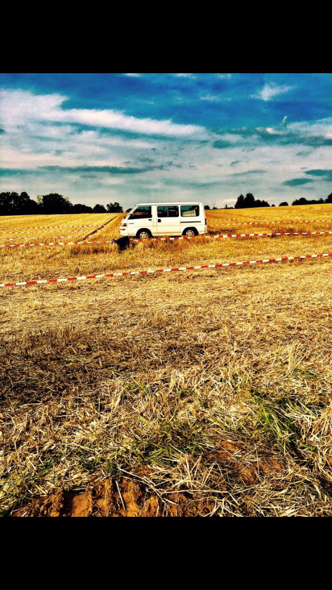
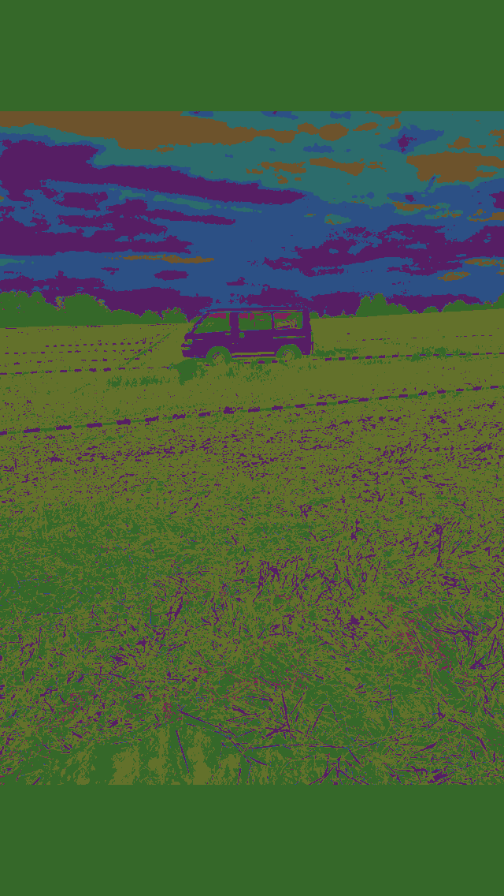

# Image clustering in Go

The _image-clustering_ program partitions the pixel in an image
based on their color to a pre-defined number of clusters.
Each cluster is a random color assigned. The resulting image 
will represent each pixel in its corresponding cluster-color.

#### Example

original         |  result with 10 clusters
:-------------------------:|:-------------------------:
  	|  

### K-Means Clustering

To achieve this we use __K-Means Clustering__, an iterative algorithm to partition a set
of data points (here colors) into a pre-defined number (k) of clusters.

The algorithm starts by assigning each cluster a randomly created centroid.
The centroid is the _"average"_ of the points in the cluster. 
After we assigned each pixel based on their color
to the cluster with nearest centroid, we recompute the centroids 
by assigning them to the average of their members.
This two steps are repeated until the centroids converged.