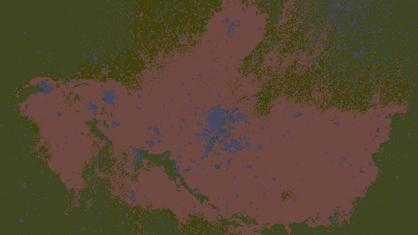
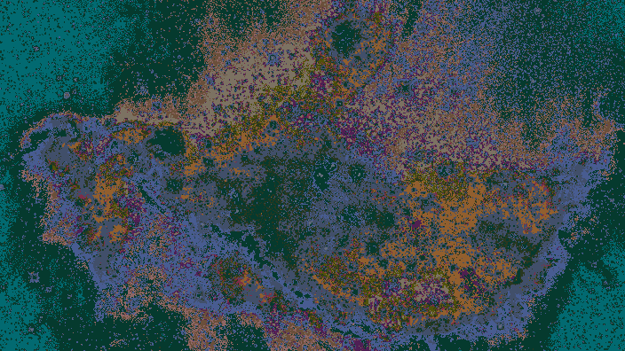
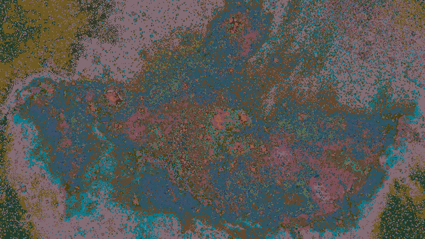

# Image-Clustering

The _image-clustering_ program partitions the pixels in an image
based on their color to a pre-defined number of clusters.

```
Usage:
  -in string
        Path to input image
  -k int
        Number of cluster (default 10)
  -out string
        Path to save clustered image (default "${HOME}/img_clustered.png")
```
### Examples:

#### original


#### k = 5


#### k = 100


#### k = 500

